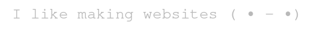

<!-- "Hero" Header -->

  
   
   
  
   
   

<!-- Social -->
<table width="100%" align="center">
<tr>
<td align="center">
<a href="https://github.com/ReidSurmeier">
<strong>Visit my personal website</strong>
 
 
 

</a>

</td>

<td align="center">
<a href="https://www.youtube.com/watch?v=3YxaaGgTQYM&ab_channel=EvanescenceVEVO">
<strong>Listen to cool music</strong>
 
 

 
</a>

</td>
</tr>
</table>

<!-- Extra image -->

   
  
   

 

<!-- Guestbook -->
| Name | Date | Message |
|---|---|---|
<!-- /Guestbook -->

<!-- Footer -->

 

&nbsp;&nbsp;&nbsp;&nbsp;  

&nbsp;&nbsp;&nbsp;&nbsp;  

